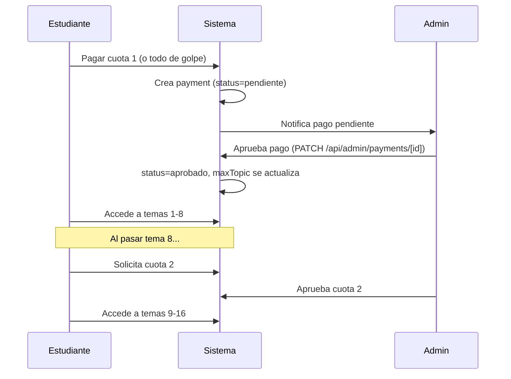

# Sistema de Pagos por Cuotas — Justicia Indígena

## Descripción del problema

El curso tiene un costo de **420 Bs** y se quiere ofrecer la opción de pagar en **3 cuotas de 140 Bs** (o de una sola vez). Cada cuota desbloquea un bloque de **8 temas**:

| Cuota | Monto | Temas desbloqueados |
|-------|-------|---------------------|
| 1ª    | 140 Bs | Temas 1–8   |
| 2ª    | 140 Bs | Temas 9–16  |
| 3ª    | 140 Bs | Temas 17–21 |
| Todo  | 420 Bs | Temas 1–21  |

El flujo es:
1. El estudiante registra su intención de pago (cuota que quiere pagar).
2. El admin aprueba/rechaza esa cuota en el panel.
3. Con cuota aprobada, el estudiante accede a los temas correspondientes.
4. Si termina los 8 temas de una cuota y quiere continuar, debe pagar la siguiente.

---

## Cambios propuestos

### 1. Base de datos — `src/lib/db.ts`

**Nueva tabla `payments`:**
```sql
CREATE TABLE IF NOT EXISTS payments (
  id INTEGER PRIMARY KEY AUTOINCREMENT,
  user_id TEXT NOT NULL,
  cuota INTEGER NOT NULL,          -- 1, 2, 3
  monto INTEGER NOT NULL,          -- 140 o 420
  status TEXT DEFAULT 'pendiente', -- 'pendiente' | 'aprobado' | 'rechazado'
  created_at DATETIME DEFAULT CURRENT_TIMESTAMP
);
```

También se agregarán migraciones para que no falle en bases de datos existentes.

**Lógica de acceso cambiada:**  
El `status` general del usuario (`activo`/`pendiente`) ya no dicta el acceso por sí solo. En cambio se calcula el `maxTopic` permitido según las cuotas aprobadas:
- Sin cuotas aprobadas → 0 temas
- Cuota 1 aprobada → hasta tema 8
- Cuotas 1+2 aprobadas → hasta tema 16
- Cuotas 1+2+3 aprobadas → hasta tema 21

---

### 2. API de temas — `src/app/api/topics/[topicOrder]/route.ts`

Modificar `getUnlockedUntil` para consultar la tabla `payments` en lugar de sólo el `status`. El `status=activo` seguirá siendo requisito para ingresar, pero el rango permitido viene de las cuotas.

- GET: devuelve `{ ..., paymentInfo: { maxTopic, cuotasPagadas } }` adicional para el frontend.
- POST (examen): valida con `paymentMaxTopic` en vez de sólo `status`.

---

### 3. API de pagos — `src/app/api/payments/route.ts` [NUEVO]

```
GET  /api/payments?userId=...        → lista las cuotas del usuario
POST /api/payments                   → registra una nueva cuota pendiente
```

### 4. API admin de pagos — `src/app/api/admin/payments/route.ts` [NUEVO]

```
GET    /api/admin/payments           → lista todos los pagos pendientes
PATCH  /api/admin/payments/[id]      → aprueba o rechaza un pago { status: 'aprobado'|'rechazado' }
```

---

### 5. Panel Admin — `src/app/admin/page.tsx`

Agregar nueva sección **"Pagos"** en la barra lateral. Muestra tarjetas de pago pendientes con:
- Nombre y email del estudiante
- Cuota N° y monto
- Fecha de solicitud
- Botones **Aprobar** / **Rechazar**

---

### 6. Página de Cursos — `src/app/courses/page.tsx`

Modificar para mostrar el estado de pagos y el botón **"Pagar Cuota X"** cuando el estudiante llega al límite de temas:
- Indicador visual de cuota actual
- Si terminó los 8 temas de la cuota activa → banner de aviso + botón para solicitar la siguiente cuota

---

### 7. Página del Tema — `src/app/courses/[topicOrder]/page.tsx`

Usar `maxTopic` en lugar de sólo `status` para el mensaje de bloqueo. Si el tema está bloqueado por falta de pago (y no por falta de progreso), mostrar un mensaje específico: *"Debes pagar la siguiente cuota para acceder a este tema."*

---

## Flujo completo



---

## Plan de Verificación

- Verificar que sin cuotas aprobadas, el estudiante no puede acceder a ningún tema (status activo pero 0 cuotas).
- Verificar que con cuota 1 aprobada, topic 9 devuelve 403.
- Verificar que el admin puede aprobar/rechazar desde el panel.
- Verificar que pago completo (420 Bs) desbloquea todos los temas de golpe.

---

## Preguntas abiertas

> [!IMPORTANT]
> ¿Los temas del 3er bloque son 17-21 (5 temas)? Si la regla es exactamente "8 por cuota", ¿el 3er bloque igual se activa completo aunque tenga menos de 8?  
> **Asumo que sí: la 3ª cuota desbloquea todos los temas restantes (17-21).**

> [!NOTE]
> Cuando el admin activa al usuario por primera vez (status → activo), ¿eso ya incluye la 1ª cuota automáticamente, o el admin debe aprobar la cuota por separado?  
> **Asumo que se mantienen separados: activar la cuenta ≠ aprobar el pago. El admin debe aprobar cada cuota.**
